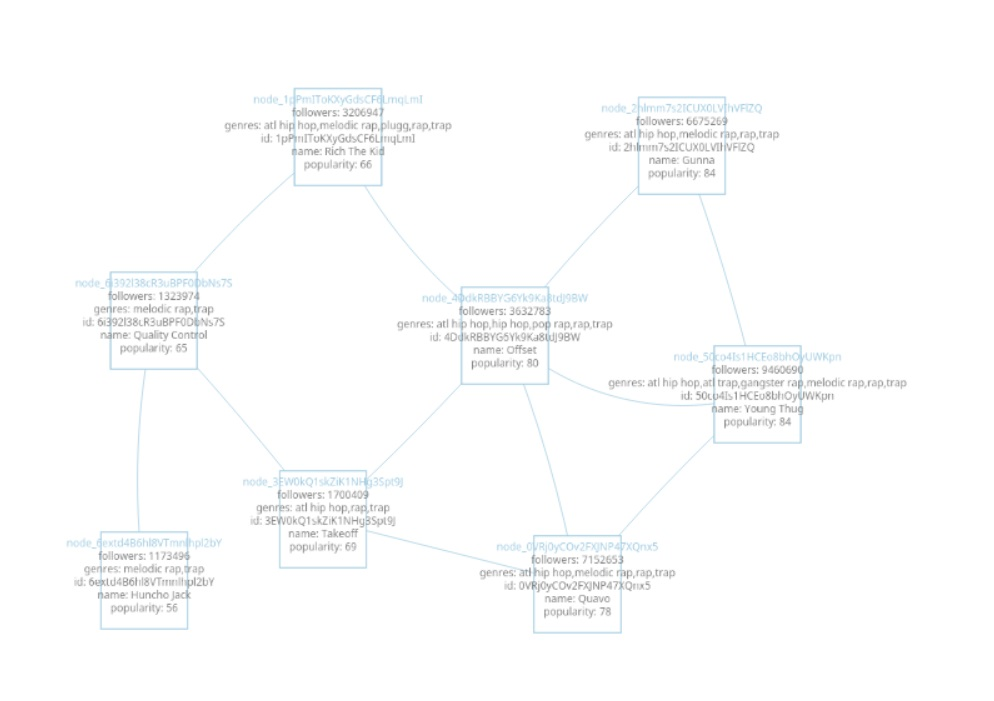
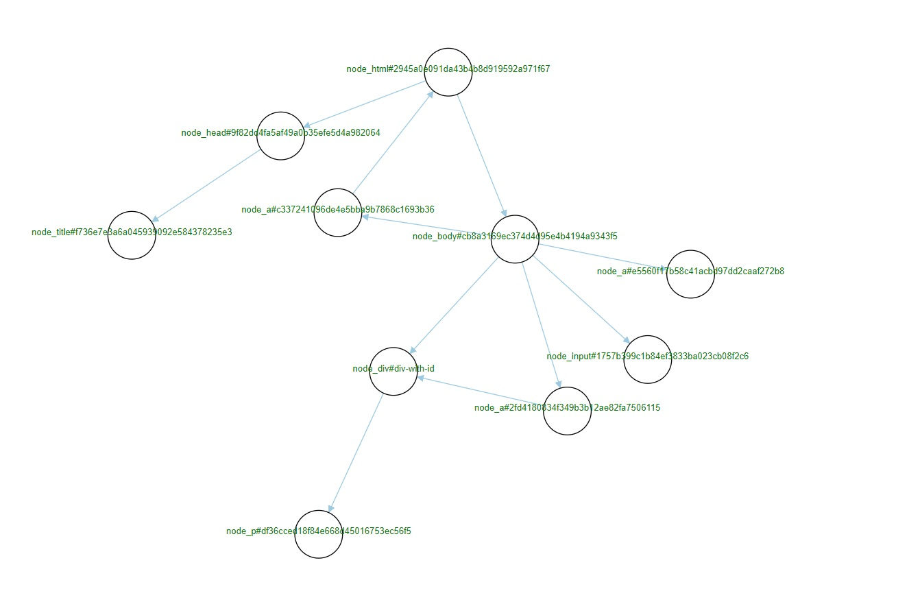
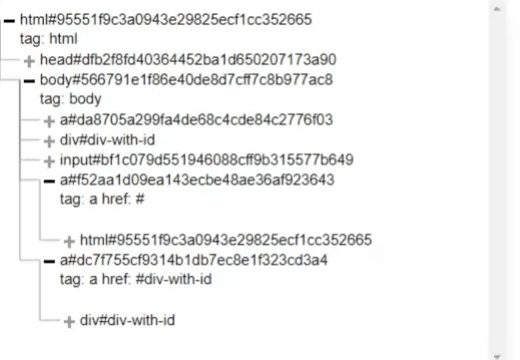
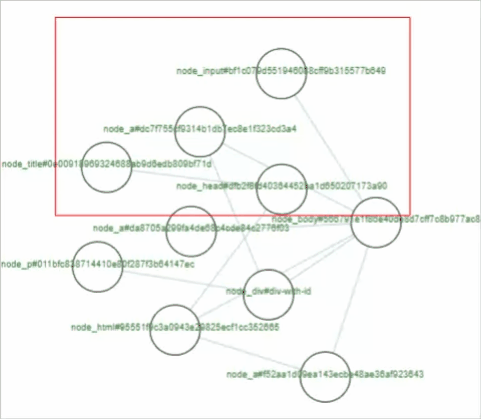
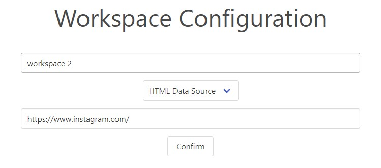

# Graph Expressiveness
## Team 6
### Team members
* Popov Vladimir SV29/2021
* Bulatović Balša SV37/2021
* Milutinović Momir SV39/2021
* Vidaković Teodor SV33/2021

## Overview

The project focuses on the visualization of graph structures, supporting multiple data sources and their seamless representation. Embracing the principles of Component-Driven Development (CDD), this software aims to empower users to effortlessly modify specific components through the utilization of plugins.

## Project Goals

- Visualize diverse graph structures.
- Support multiple data sources for enhanced flexibility.
- Embrace Component-Driven Development principles.
- Facilitate easy modification of software components using plugins.

## Key Features

- **Graph Visualization:** Effortlessly visualize various types of graph structures.
- **Data Source Support:** Enable the integration of multiple data sources for comprehensive visualization.
- **Component-Driven Development:** Leverage the benefits of object-oriented programming to enhance flexibility and maintainability.
- **Plugin System:** Empower users to modify and extend software components through a robust plugin architecture.

## Technologies

- **Frontend:**
  - [D3.js](https://d3js.org/): JavaScript library for data visualization.

- **Backend:**
  - [Django](https://www.djangoproject.com/): Web framework for building Python applications.

- **Programming Languages:**
  - [Python](https://www.python.org/): General-purpose programming language.
  - [JavaScript](https://developer.mozilla.org/en-US/docs/Web/JavaScript): Programming language for the web.

- **Version Control:**
  - [Git](https://git-scm.com/): Distributed version control system.

- **Package Management:**
  - [pip](https://pip.pypa.io/): Package installer for Python.

## Plugin Architecture

Plugins are essential components of the application, enabling users to extend and modify the software's functionality.
Plugins are created by implementing and using the API package, which provides abstractions for Data Source and Visualizer plugins.


### API Package Overview

The API library is a Python package designed to provide abstractions modeling APIs for Data Source and Visualizer plugins. This library is intended to serve as a dependency for both the platform (which uses the API) and all plugins (that implement the API).

### Key Components

#### 1. Graph Model

The `Graph` model represents the structure of a graph and provides methods for manipulation.

#### 2. Node Model

The `Node` model represents a node in the graph, encapsulating node-specific properties and data.

#### 3. Edge Model

The `Edge` model represents an edge between two nodes in the graph.
Edges, like nodes, encapsulate edge-specific properties and data.


#### 4. Plugin Abstractions

Application supports two types of plugins: `data source plugins` and `visualizer plugins`.


The API defines two abstract classes:

- `Visualizer`: Abstract class for implementing Visualizer plugins. The structure is as follows:
  ```python
  class Visualizer(ABC):
      @abstractmethod
      def get_name(self) -> str:
          pass
  
      @abstractmethod
      def display(self, graph: Graph):
          pass
  ```
- `DataSource`: Abstract class for implementing Data Source plugins. The structure is as follows:
  ```python
  class DataSource(ABC):
      @abstractmethod
      def get_name(self) -> str:
          pass
  
      @abstractmethod
      def provide(self, **kwargs) -> Graph:
          pass
  
      @abstractmethod
      def get_configuration_parameters(self) -> dict[str, str]:
          pass
  ```

These abstract classes provide a foundation for creating plugins by specifying required methods and properties.


## Plugin Development
In order to create a new plugin, you need to implement the interface for the kind of plugin you are writing and provide an entry point for the plugin.
Note that it is not necessary to use the API package, but it is recommended to use it in order to have a consistent interface for all plugins.


### Packaging

To make plugins usable by the platform, they need to be packaged and distributed. The suggested way to package plugins is by using the `pyproject.toml` file and creating entry points for each plugin type.

Here is an example of how to provide entry point for each plugin type:

- **Data source plugin:**
  ```toml
  [project.entry-points."data-sources"]
  name_of_data_source = "path.to.data_source.class:DataSourceClass"
  ```


- **Visualizer plugin:**
  ```toml
  [project.entry-points."visualizers"]
  name_of_visualizer = "path.to.visualizer.class:VisualizerClass"
  ```

## Implementation

### Data Source Plugins

We have developed two distinct Data Source plugins, each serving a specific purpose:

1. **HTML Data Source:**
   - Description: This plugin is designed to retrieve data from HTML documents and represent it as a graph.
   - Source Code: [HTML Data Source Plugin](./html_datasource)
   - In addition to parent-child relationships in the HTML document, the graph also includes links between `<a>` elements and the elements referenced by their `href` attributes if the referenced elements are within the document.
   - Graphs produced by this data source may be cyclic due to the inclusion of intradocument links.
   - Here is the example of the HTML document, and it's graph representation:
       ```html
        <html lang="en">
        <head>
            <meta charset="UTF-8">
            <meta name="viewport" content="width=device-width, initial-scale=1.0">
            <title>Circular HTML Example</title>
        </head>
        <body>
            <a href="somewebsite.com">Some Website</a>
        
            <div id="div-with-id" style="background-color: red;">
                <p style="color: rebeccapurple;">Hello Everyone</p>
            </div>
            
            <input type="text" value="Balsa"/>
            <a href="#">Href to the page root</a>
            <a href="#div-with-id">Href to the div with id</a>
        </body>
        </html>
        ```
        
   

2. **Spotify Data Source:**
   - Description: The Spotify Data Source plugin allows fetching data from the Spotify API (artist's related artists).
   - Source Code: [Spotify Data Source Plugin](./spotify_datasource)
   


### Visualizer Plugins

In addition to Data Source plugins, we've created two Visualizer plugins to enhance graph visualization:

1. **Simple Visualizer:**
   - Description: The Simple Visualizer offers straightforward visualization capabilities for basic graph structures.
   - Source Code: [Simple Visualizer Plugin](./simple_visualizer)
   


2. **Advanced Visualizer:**
   - Description: For more complex graph visualization needs, the Advanced Visualizer provides enhanced features and functionalities.
   - Source Code: [Advanced Visualizer Plugin](./advanced_visualizer)
    


### Software Components

The software is divided into three main views:
- **Main View**
- **Tree View**
- **Bird View**

### Main View
`The Main View` represents a canvas that visualizes the graph in two ways using `visualizer` plugins.

Provides operations such as `pan`, `zoom`, `drag` and `drop`
- Nodes are draggable and can be moved around the canvas. 
- The canvas can be panned and zoomed in and out using the mouse or touchpad.


### Tree View
`The Tree View` (graph representation as a tree) allows dynamic expanding and collapsing of nodes,
similar to the package explorer in IDEs.

- `plus` sign next to an object indicates that it can be expanded
- `minus` sign means that the object can be collapsed.



## Bird View

`Bird View` (Graph Overview from a Bird's-Eye Perspective) is a reduced representation of the graph that must entirely fit within the canvas.

Bird View mirrors the Main View with the key difference that the entire graph fits into the canvas. 
Bird View encompass the viewport that moves in accordance with the current display on the Main View.
The behavior of the viewport is defined as follows:

- `Zooming out` the Main View shrinks the viewport on the Bird View.
- `Zooming in` the Main View enlarges the viewport on the Bird View.
- `Panning` the Main View moves the viewport on the Bird View.
- `Dragging` the nodes on the Main View affects the graph on the Bird View.



All three graph views are simultaneously accessible and present the same graph in the aforementioned ways.

### Graph View Features

- **Main View:**
  - Pan: Allows dragging the graph to view different parts of it.
  - Zoom In/Out: The graph can be zoomed in or out.
  - Drag and Drop: Allows moving nodes within the Main View.

- **Tree View:**
  - Expand/Collapse Nodes: Dynamically opens and closes nodes.

- **Bird View:**
  - Scaling: Adjusts the view according to operations on the Main View.
  - Synchronization: Mirrors the movement and changes in the Main View.

## Search and Filter Functionality

Our application's search and filter features are designed to enhance the user experience by providing precise control over the visualization of graph data. Users can search across node attributes and apply filters to isolate graph elements that meet specific criteria.

### Search Functionality

#### Text-Based Search

- Users can input arbitrary text into a search field to query the graph.
- A subgraph is generated, displaying only the nodes that contain an attribute name or value matching the search term.
- This is particularly useful for navigating large graphs, allowing for quick location of relevant nodes.

### Filter Functionality

#### Applying Filters

- Filters are applied through a dedicated text input field using the following format:
    ```
    <attribute_name> <comparator> <attribute_value>
    ```
  
- Available `<comparator>` options include: `==`, `>`, `>=`, `<`, `<=`, `!=`, `contains`, `matches`, `divisible by`.
- Applying a filter creates a subgraph from the current graph with nodes that have attributes satisfying the filter criteria.

### Successive Application of Search and Filters

- Our platform supports the sequential application of searches and filters.
- Users can layer these operations to incrementally refine the graph.
- The visualization updates in real-time to reflect the current active criteria, maintaining clarity and precision.

### User Interface for Search and Filters

- The UI elements for search and filter operations are designed for intuitive use, with input fields and visual updates on the graph.
- A control panel allows users to easily manage their search and filter parameters within the visualization interface.


With these features, users can easily analyze complex graphs and focus on the most relevant data for their needs.

## Workspaces

The platform is designed to seamlessly detect all installed Data Source plugins, offering users the flexibility to choose from various data sources for graph visualization. The application supports loading multiple graphs from different (or the same) data sources simultaneously.

### Workspace Definition

A **workspace** is a unique environment within the application that encapsulates a single data source, along with any active filters and search queries applied to the graph visualization. This design allows users to work on multiple analyses concurrently, each with its own set of parameters and visualizations.

### Workspace Features

- **Data Source Integration**: Users can select the desired data source for each workspace from the available Data Source plugins.

- **Multiple Concurrent Workspaces**: The platform supports the creation and management of multiple workspaces, enabling users to switch between different graphs or projects without losing their progress. Each workspace operates independently, ensuring that actions in one workspace do not affect others.

- **Custom Filters and Searches**: In each workspace, users can use custom filters and search functions to refine their graph visualizations. This makes it easier to analyze data and discover insights.

### Workspace Management Component

This component is integrated into the primary interface of the application and offers a seamless user experience for managing workspaces. It allows for the selection, editing, deletion, or creation of new workspaces with ease.


### Workspace Configuration Page

When users click the 'Create' or 'Edit' button in the Workspace Management Component, they are navigated to the Workspace Configuration Page. On this page, users can assign a name to their workspace and choose a data source from a dropdown menu. Additionally, users can input the necessary parameters for the selected data source.



### Implementing Workspaces

Implementing workspaces involves creating a user interface component that allows for the creation, deletion, and switching of workspaces. This UI component works with the application's backend to dynamically load data sources and apply user-defined filters or searches for each selected workspace. Unlike traditional approaches that persist workspace states in a database, our implementation temporarily stores this information in memory for the duration of a user session.

By incorporating workspaces into the application, we aim to enhance the user experience by providing a flexible and efficient environment for graph visualization and analysis. This feature supports our goal of making complex data more accessible and actionable for our users.


## Installation

To install the project, follow these steps:

1. Clone the repository:
   ```bash
   git clone https://github.com/MomirMilutinovic/graph-expressiveness-team-6.git
   ```
2. Navigate to the project directory:
   ```bash
    cd path/to/graph-expressiveness-team-6
    ```
3. Create and activate a virtual environment:
    - Windows:
       ```bash
       python -m venv venv
       venv\Scripts\activate
       ```
    - Linux/macOS:
         ```bash
         $ python3 -m venv venv
         $ source venv/bin/activate
         ```
   
4. Install the required packages:
   ```bash
   pip install -r requirements.txt
   ```
   
5. Install the required application packages:
   ```bash
   pip install ./core-sok
   pip install ./api-sok
   ```
   
6. Install the plugins:
    ```bash
    pip install ./html_datasource
    pip install ./spotify_datasource
    pip install ./simple_visualizer
    pip install ./advanced_visualizer
    ```
    > ***Tip:** If you want to install plugins that will apply changes when you modify their source code, you can use the `-e` flag to install them in editable mode.*
    > ```bash
    > pip install -e ./html_datasource
    > ```
7. Run the server:
    - Windows:
        ```bash
        python graph_explorer/src/graph_explorer/manage.py runserver [port]
        ```
    - Linux/macOS:
        ```bash
        $ python3 graph_explorer/src/graph_explorer/manage.py runserver [port]
        ```
      
   You should get the output similar to the following:
   ```
    Watching for file changes with StatReloader
    Performing system checks...
    
    System check identified no issues (0 silenced).
    February 08, 2024 - 03:42:21
    Django version 5.0, using settings 'graph_explorer.settings'
    Starting development server at http://127.0.0.1:[port]/
    Quit the server with CTRL-BREAK.
   ```
8. Open your web browser and navigate to the following URL:
   ```
   http://127.0.0.1:[port]/ (8000 if you didn't specify the port)
   ```
    You should see the application's main page.

### Alternative Installation
Instead of steps [5-7] you can use the script to install and run the application and all plugins at once:
    
- Windows:
    ```bash
    ./installAndRun.bat
    ```
- Linux/macOS:
    ```bash
    $ ./installAndRun.sh
    ```
